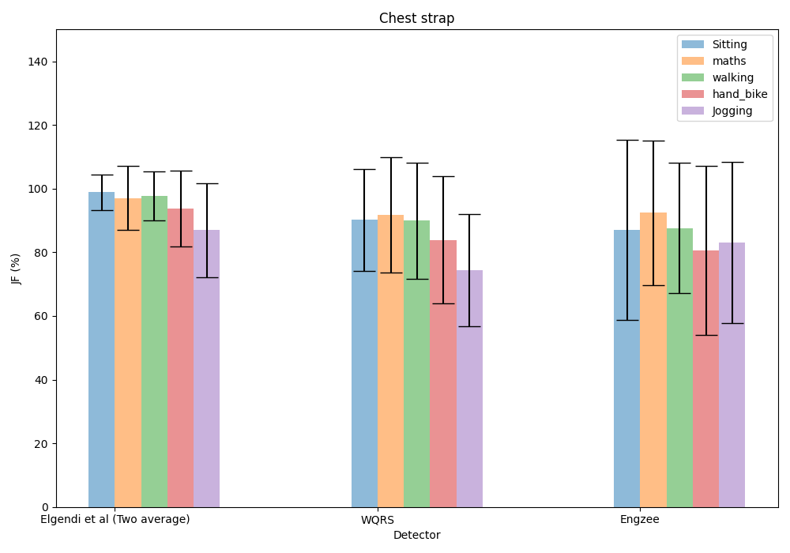
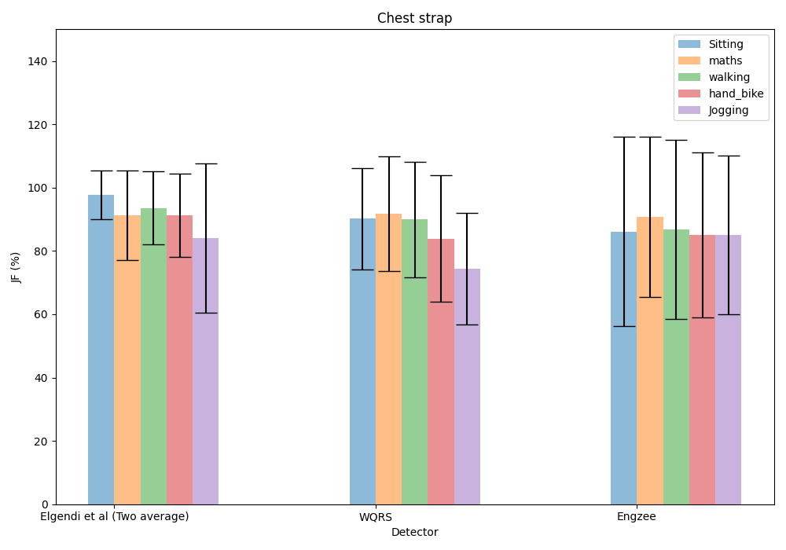
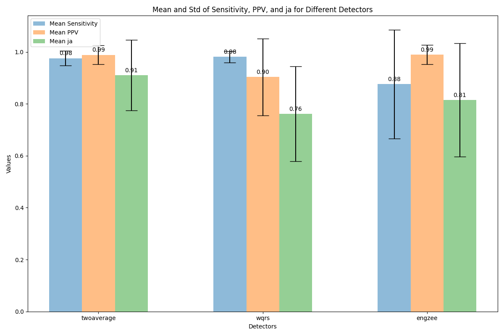

# my-ecg-detector-test-data
the test data for my c++ ecg rpeaks detecter project:https://github.com/chaos0607/ecg_detector

originally data form: https://github.com/berndporr/ECG-GUDB/tree/master/docs/experiment_data

i applied my ECG detector and save my R-peak results in rpeaks_twoaverage.tsv and rpeaks_wqrs.tsv.

use a modified script jf_stats_detectors.py from https://github.com/berndporr/JF-ECG-Benchmark to check the score of the detector

file lists:

**experiment_data**: original data set from https://github.com/berndporr/ECG-GUDB

**MIT-BIH**: MIT-BIH Arrhythmia Database from https://www.physionet.org/content/mitdb/1.0.0/ , processed to extracted signal 0 from original format 

**analysis_results**: the analysis result of python JF-ECG-Benchmark

​	**analysis_output.txt**: the overall detector JF marks generated by jf_stats_detectors.py

​	**cpp_jf_two_average_detector.json**: cpp detectors evaluate results by  modified jf_evaluate_all_detectors.py

## **VERSION 2024/07/31** 

​	current data is correspond to  ecg_detector version0.3

### UOFG dataset 

​	this is the score for  c++ ecg rpeaks detecter

original result data:

`JF Score of cpp detectors: sitting chest strap`
`two_average_detector: 98.9+/-5.6`
`wqrs_detector: 90.2+/-16.0`
`engzee_detector: 87.1+/-28.4`

`JF Score of cpp detectors: maths chest strap`
`two_average_detector: 97.1+/-10.2`
`wqrs_detector: 91.7+/-18.2`
`engzee_detector: 92.4+/-22.6`

`JF Score of cpp detectors: walking chest strap`
`two_average_detector: 97.7+/-7.8`
`wqrs_detector: 89.9+/-18.3`
`engzee_detector: 87.6+/-20.5`

`JF Score of cpp detectors: hand bike chest strap`
`two_average_detector: 93.7+/-12.0`
`wqrs_detector: 83.9+/-19.9`
`engzee_detector: 80.6+/-26.6`

`JF Score of cpp detectors: jogging chest strap`
`two_average_detector: 86.9+/-14.6`
`wqrs_detector: 74.5+/-17.6`
`engzee_detector: 83.1+/-25.3`

​	this the score for the originally python ecg rpeaks detecter

original result data:

`JF Score of cpp detectors: sitting chest strap`
`two_average_detector: 97.7+/-7.8`
`wqrs_detector: 90.2+/-16.0`
`engzee_detector: 86.1+/-29.9`

`JF Score of cpp detectors: maths chest strap`
`two_average_detector: 91.4+/-14.2`
`wqrs_detector: 91.7+/-18.2`
`engzee_detector: 90.8+/-25.2`

`JF Score of cpp detectors: walking chest strap`
`two_average_detector: 93.6+/-11.6`
`wqrs_detector: 89.9+/-18.3`
`engzee_detector: 86.8+/-28.3`

`JF Score of cpp detectors: hand bike chest strap`
`two_average_detector: 91.3+/-13.1`
`wqrs_detector: 83.9+/-19.9`
`engzee_detector: 85.1+/-26.1`

`JF Score of cpp detectors: jogging chest strap`
`two_average_detector: 84.1+/-23.5`
`wqrs_detector: 74.5+/-17.6`
`engzee_detector: 85.1+/-25.2`

​	from this three groups results, we can see that the result of cpp detectors matched the precision of original python detectors, 

however , The Engzee detector is very unstable and performs very poorly in a few special instances, almost failing to detect anything. this happens both to python detector and cpp detector

### MIT-BIH Arrhythmia Database

Detector: twoaverage, Mean Sensitivity: 0.9755976795418994, Std Sensitivity: 0.02824659766068096
Detector: twoaverage, Mean PPV: 0.988487156794651, Std PPV: 0.036630861554513595
Detector: twoaverage, Mean ja: 0.9106579282379765, Std ja: 0.13572995680366207
Detector: wqrs, Mean Sensitivity: 0.9813557198828137, Std Sensitivity: 0.021862143780313082
Detector: wqrs, Mean PPV: 0.9034370404515203, Std PPV: 0.14790034975029095
Detector: wqrs, Mean ja: 0.7618112529987624, Std ja: 0.18298937979138025
Detector: engzee, Mean Sensitivity: 0.875702817924163, Std Sensitivity: 0.2094995505200995
Detector: engzee, Mean PPV: 0.9899900322670581, Std PPV: 0.03732703907310337
Detector: engzee, Mean ja: 0.8147071567350684, Std ja: 0.21859719734438665

