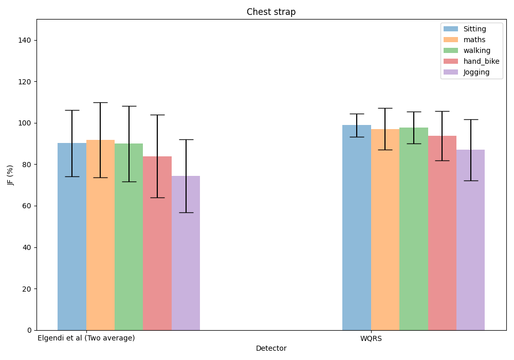
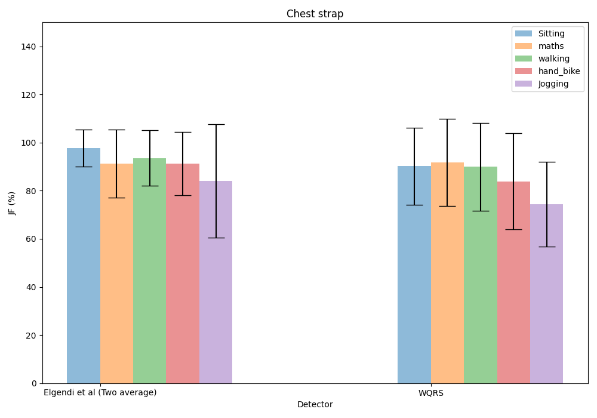

# my-ecg-detector-test-data
the test data for my c++ ecg rpeaks detecter project:https://github.com/chaos0607/ecg_detector

originally data form: https://github.com/berndporr/ECG-GUDB/tree/master/docs/experiment_data

i applied my ECG detector and save my R-peak results in rpeaks_twoaverage.tsv and rpeaks_wqrs.tsv.

use a modified script jf_stats_detectors.py from https://github.com/berndporr/JF-ECG-Benchmark to check the score of the detector

**2024/07/29** 

​	current data is correspond to  ecg_detector version0.1

​	this is the score for  c++ ecg rpeaks detecter

​	this the score for the originally python ecg rpeaks detecter

​	from this two pictures, we can found that the two-average detector need more improvements.

​	the error may comes from the pause delay of iir filter, here needs more work

